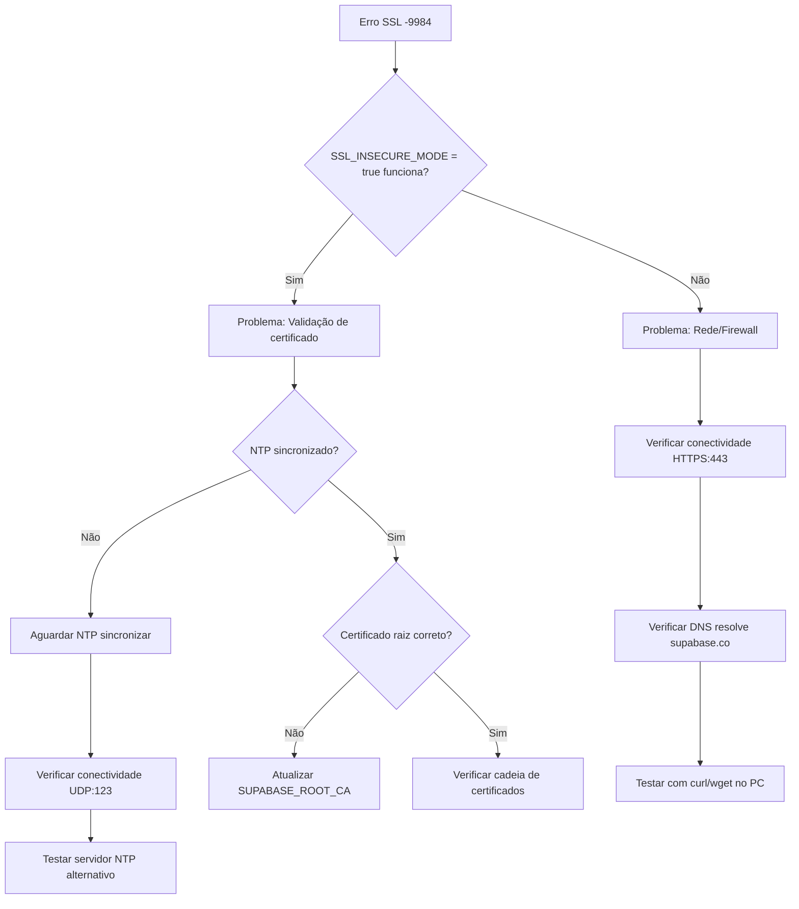

# 🔐 Troubleshooting SSL/TLS no ESP32 AquaSys

## 📋 Visão Geral

Este guia explica como resolver problemas de validação de certificados SSL no firmware ESP32 do AquaSys, especialmente o erro **`-9984 X509 - Certificate verification failed`**.

## ❌ Sintomas Comuns

### Erro no Serial Monitor:
```
[ssl_starttls_handshake():317]: (-9984) X509 - Certificate verification failed
[NetworkClientSecure.cpp:159] connect(): start_ssl_client: connect failed: -9984
[HTTPClient.cpp:1423] returnError(): error(-1): connection refused
[ERROR] Autenticação falhou. HTTP: -1
```

### Causas Principais:
1. **NTP não sincronizado** (mais comum)
2. Certificado SSL desatualizado no firmware
3. Certificado raiz incorreto
4. Problemas de rede/firewall

---

## 🔧 Solução Rápida: Modo Debug SSL

### 1. Habilitar `SSL_INSECURE_MODE`

No arquivo `.ino`, altere a linha ~94:

```cpp
// Modo DEBUG (ignora validação SSL)
const bool SSL_INSECURE_MODE = true;  // ✅ Apenas para debug!
```

⚠️ **ATENÇÃO**: Este modo **desabilita a validação de certificados SSL**, permitindo conexões inseguras. Use **APENAS** para diagnóstico.

### 2. Fazer Upload e Testar

1. Compile e faça upload do firmware
2. Abra o Serial Monitor (115200 baud)
3. Observe os logs:

```
[INFO ] Autenticando dispositivo...
[WARN ] ⚠️  SSL_INSECURE_MODE ATIVO - Certificado SSL ignorado!
[WARN ] ⚠️  Modo inseguro - Use apenas para debug/diagnóstico
[INFO ] ✅ Autenticação bem-sucedida!
```

✅ **Se funcionou com `SSL_INSECURE_MODE = true`**: O problema é a **validação de certificados**, provavelmente NTP não sincronizado.

❌ **Se ainda falhar**: Problema de rede ou configuração do servidor.

---

## 🕐 Solução Definitiva: Sincronizar NTP

### Por que o NTP é crítico para SSL?

Certificados SSL têm **validade temporal**. Se o ESP32 achar que está em 1970, ele rejeita qualquer certificado como "expirado".

### Verificar Sincronização NTP:

Procure estas linhas no Serial Monitor:

```
[INFO ] Sincronizando NTP...
[INFO ] NTP configurado
[INFO ] NTP sincronizado: 2025-11-04 00:46:58  ✅ CORRETO
```

ou

```
[ERROR] NTP NÃO SINCRONIZOU - SSL pode falhar!  ❌ PROBLEMA
```

### Checklist de Validação NTP:

- [ ] Roteador permite conexões UDP na porta 123?
- [ ] Servidor NTP está acessível (`pool.ntp.org`)?
- [ ] WiFi está conectado antes de sincronizar NTP?
- [ ] Aguardou pelo menos 10 segundos após conectar WiFi?

### Solução:

1. Garantir que o firmware aguarda NTP **ANTES** de autenticar:

```cpp
// setup() - Linhas 307-330 do v4.2.3
if (wifiConnected && !apMode) {
  logMessage(LOG_INFO, "Sincronizando NTP...");
  setupNTP();
  
  // Aguardar sincronização (máx 10s)
  int ntpAttempts = 0;
  while (ntpAttempts < 20) {
    struct tm timeinfo;
    if (getLocalTime(&timeinfo)) {
      ntpSynced = true;
      logMessage(LOG_INFO, "NTP sincronizado: " + getTimestamp());
      break;
    }
    delay(500);
    ntpAttempts++;
  }
}
```

2. Se NTP continuar falhando, verifique:
   - Firewall do roteador
   - Trocar para servidor NTP alternativo: `time.google.com`, `time.nist.gov`

---

## 🔐 Validação de Certificado SSL

### Certificado Atual (v4.2.3):

O firmware usa o **Let's Encrypt ISRG Root X1** (linhas 53-85):

```cpp
const char* SUPABASE_ROOT_CA = R"EOF(
-----BEGIN CERTIFICATE-----
MIIFazCCA1OgAwIBAgIRAIIQz7DSQONZRGPgu2OCiwAwDQYJKoZIhvcNAQELBQAw
...
-----END CERTIFICATE-----
)EOF";
```

### Verificar Certificado Supabase:

Use OpenSSL para confirmar que o certificado está correto:

```bash
openssl s_client -connect oaabtbvwxsjomeeizciq.supabase.co:443 -showcerts
```

Procure por:
```
issuer=C = US, O = Let's Encrypt, CN = R11
subject=CN = oaabtbvwxsjomeeizciq.supabase.co
```

Se o certificado mudou, atualize o firmware com o novo certificado raiz.

---

## 📊 Fluxo de Decisão: SSL Debug



---

## ✅ Checklist de Validação SSL

### Antes de Produção:

- [ ] `SSL_INSECURE_MODE = false` (modo seguro)
- [ ] NTP sincroniza em até 10s
- [ ] Certificado raiz Supabase atualizado
- [ ] Serial Monitor mostra `✅ SSL seguro ativado`
- [ ] Serial Monitor mostra `✅ Autenticação bem-sucedida!`

### Para Debug:

- [ ] `SSL_INSECURE_MODE = true` (modo inseguro - temporário)
- [ ] Observar logs detalhados de SSL
- [ ] Confirmar que dispositivo conecta ao servidor
- [ ] Após identificar problema, retornar a `SSL_INSECURE_MODE = false`

---

## 🛠️ Modos SSL no Firmware

### Modo Seguro (Produção):
```cpp
const bool SSL_INSECURE_MODE = false;

// No authenticateDevice():
wifiClient.setCACert(SUPABASE_ROOT_CA);  // Valida certificado
```

**Logs:**
```
[INFO ] ✅ SSL seguro ativado - Validando certificado Supabase
[INFO ] ✅ NTP sincronizado - Certificado será validado
[INFO ] ✅ Autenticação bem-sucedida!
```

### Modo Inseguro (Debug):
```cpp
const bool SSL_INSECURE_MODE = true;

// No authenticateDevice():
wifiClient.setInsecure();  // Ignora certificado
```

**Logs:**
```
[WARN ] ⚠️  SSL_INSECURE_MODE ATIVO - Certificado SSL ignorado!
[WARN ] ⚠️  Modo inseguro - Use apenas para debug/diagnóstico
[INFO ] ✅ Autenticação bem-sucedida!
```

---

## 🚨 Quando Pedir Ajuda

Se após seguir este guia o problema persistir, reúna estas informações:

1. **Serial Monitor completo** desde o boot até o erro
2. **Versão do firmware** (ex: v4.2.3-STABLE)
3. **Modo SSL** (insecure ou secure)
4. **Status NTP** (sincronizado ou não)
5. **Rede WiFi** (nome, sem senha)
6. **Teste curl** do PC na mesma rede:
   ```bash
   curl -v https://oaabtbvwxsjomeeizciq.supabase.co/functions/v1/device-auth
   ```

---

## 📚 Referências

- [ESP32 WiFiClientSecure](https://github.com/espressif/arduino-esp32/blob/master/libraries/WiFiClientSecure/src/WiFiClientSecure.h)
- [Let's Encrypt Root Certificates](https://letsencrypt.org/certificates/)
- [mbedTLS Error Codes](https://github.com/Mbed-TLS/mbedtls/blob/development/include/mbedtls/error.h)
- [NTP Time Sync ESP32](https://randomnerdtutorials.com/esp32-date-time-ntp-client-server-arduino/)

---

**Versão:** 1.0  
**Data:** 2025-11-04  
**Firmware:** v4.2.3-STABLE
